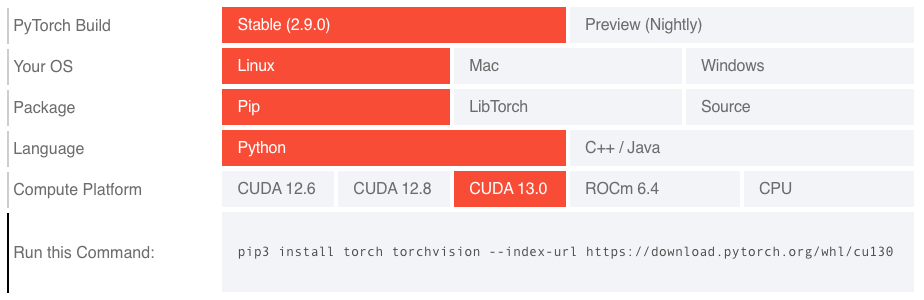
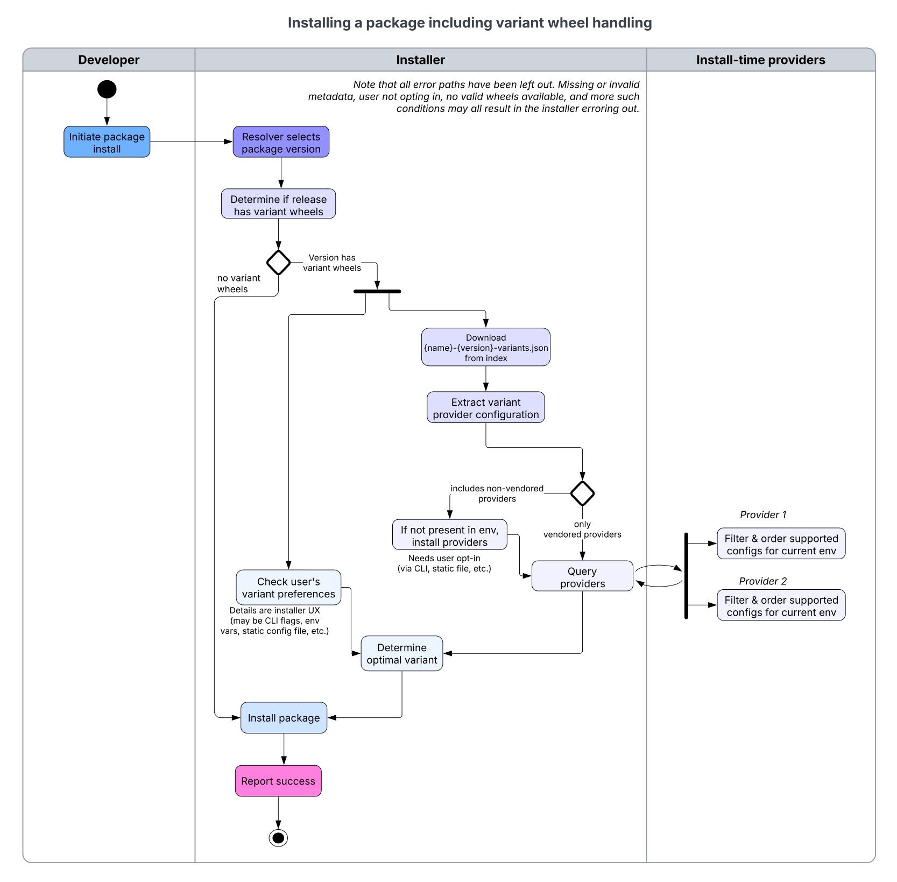

PEP: 817
Title: Wheel Variants: Beyond Platform Tags
Author: Jonathan Dekhtiar <jonathan@dekhtiar.com>,
        Michał Górny <mgorny@quansight.com>,
        Konstantin Schütze <konstin@mailbox.org>,
        Ralf Gommers <ralf.gommers@gmail.com>,
        Andrey Talman <atalman@meta.com>,
        Charlie Marsh <charlie@astral.sh>,
        Michael Sarahan <msarahan@gmail.com>,
        Eli Uriegas <eliuriegas@meta.com>,
        Barry Warsaw <barry@python.org>,
        Donald Stufft <donald@stufft.io>,
        Andy R. Terrel <andy.terrel@gmail.com>
Discussions-To: https://discuss.python.org/t/pep-817-wheel-variants-beyond-platform-tags/105860
Status: Draft
Type: Informational
Topic: Packaging
Created: 10-Dec-2025
Post-History: `24-Jan-2026 <https://discuss.python.org/t/pep-817-wheel-variants-beyond-platform-tags/105860>`__

Abstract
========

Python's existing wheel packaging format uses
:doc:`packaging:specifications/platform-compatibility-tags` to specify a
given wheel's supported environments. These tags are unable to express
modern hardware configurations and their features, such as the
availability of GPU acceleration. The tags fail to provide custom
package variants, such as builds against different dependency ABIs.
These inabilities are particularly challenging for scientific computing,
artificial intelligence (AI), machine learning (ML), and
high-performance computing (HPC) communities.

This PEP proposes "Wheel Variants", an extension to the
:doc:`packaging:specifications/binary-distribution-format`. This
extension introduces a mechanism for package maintainers to declare
multiple variant builds for the same package version, while allowing
installers to automatically select the most appropriate variant based on
system hardware and software characteristics. More specifically, it
proposes:

- An evolution of the wheel format called **Wheel Variant** that allows
  wheels to be distinguished by hardware or software attributes.

- A **variant provider plugin** interface that allows installers to
  dynamically detect platform attributes and select the most suitable
  wheel.

The goal is for the obvious installation commands (``{tool} install
<package>``) to select the most appropriate wheel, and provide the best
user experience.

Informational PEP
-----------------

This PEP presents the minimal scope required to meet modern heterogenous
system needs. It leaves aspects beyond the minimal scope to evolve via
tools or future PEPs. A non-exhaustive list of these aspects include:

- The format of a static file to select variants deterministically or
  include variants in a ``pylock.toml`` file,
- The list of variant providers that are vendored or re-implemented by
  installers,
- The specific opt-in mechanisms and UX for allowing an installer to run
  non-vendored variant providers,
- How to instruct build backends to emit variants through the :pep:`517`
  mechanism.

Motivation
==========

The `2024 Python Developers Survey`__ shows that a significant
proportion of Python's users have scientific computing use-cases. This
includes data analysis (40% of respondents), machine learning (30%), and
data engineering (30%). Many of the software packages developed for
these areas rely on diverse hardware features that cannot be adequately
expressed in the current wheel format, as highlighted in `the
limitations of platform compatibility tags`_.

__ https://lp.jetbrains.com/python-developers-survey-2024/#purposes-for-using-python

For example, packages such as PyTorch_ need to
be built for specific CUDA or ROCm versions, and that information cannot
currently be included in the wheel tag. Having to build multiple wheels
targeting very different hardware configurations forces maintainers into
various distribution strategies that are suboptimal, and create friction
for users and authors of other software who wish to depend on the
package in question.

A few existing approaches are explored in `Current workarounds and their
drawbacks`_. They include maintaining separate package indexes for
different hardware configurations, bundling all potential variants into
a single wheel of considerable size, or using separate package names
(``mypackage-gpu``, ``mypackage-cpu``, etc.). Each of these approaches
has significant drawbacks and potential security implications.

The limitations of platform compatibility tags
----------------------------------------------

The current wheel format encodes compatibility through three platform
tags:

1. **Python tag**: encoding the minimum Python version and optionally
   restricting Python distributions (e.g., ``py3`` for any Python 3,
   ``py313`` for Python 3.13 or newer, ``cp313`` for specifically
   CPython, 3.13 or newer).
2. **ABI tag**: encoding the Python ABI required by any extension
   modules (e.g., ``none`` for no requirement, ``abi3`` for the CPython
   stable ABI, ``cp313`` for extensions requiring CPython 3.13 ABI).
3. **Platform tag**: currently encoding the operating system,
   architecture and core system libraries (e.g., ``any`` for any
   platform, ``manylinux_2_34_x86_64`` for x86-64 Linux system with
   glibc 2.34 or newer, ``macosx_14_0_arm64`` for arm64 macOS 14.0
   or newer system.

These tags are limited to expressing the most fundamental properties
of the Python interpreter, operating system and the broad CPU
architectures. They cannot express anything more detailed, including
non-CPU hardware requirements or library ABI constraints.

This lack of flexibility has led many projects to find sub-optimal - yet
necessary - workarounds, such as the manual installation command
selector provided by the PyTorch team. This complexity represents a
fundamental scalability issue with the current tag system that is not
extensible enough to handle the combinatorial complexity of build
options.

Current workarounds and their drawbacks
---------------------------------------

Runtime CPU dispatching
'''''''''''''''''''''''

Projects such as NumPy_ currently resort to building wheels for a
baseline CPU target, and using runtime dispatching for
performance-critical routines. Such a solution requires additional
effort from package maintainers, and usually doesn't let the code
benefit from compiler optimizations outside the few select functions.

For comparison, building GROMACS_ for
higher CPU baselines proved to provide significant speedups:

    .. figure:: pep-0817/avx512_gromacs_benchmark.svg
        :alt: A bar graph comparing GROMACS performance (in ns/day) with
              various targets. The first two bars are labeled "yum
              (2018.8)" and "generic (SSE2)", reach about 1.0 ns/day and
              are both marked as "SSE2". The next bar is labeled
              "ivybridge" ("AVX") and reaches almost 1.5 ns/day. Two
              following bars are labeled "haswell" and "broadwell" (both
              "AVX2") and exceed 1.5 ns/day slightly. The last two bars
              are labeled "skylake_avx512" and "cascadelake" (both
              "AVX512") and reach almost 2.0 ns/day.

        Performance of GROMACS 2020.1 built for different generations of
        CPUs. Vertical axis shows performance expressed in ns/day, a
        GROMACS-specific measure of simulation speed (higher is better).

    Compiling GROMACS_ for architectures that can exploit the AVX-512
    instructions supported by the Intel Cascade Lake microarchitecture
    gives an additional 18% performance improvement relative to using
    AVX2 instructions, with a speedup of about 70% compared to a generic
    GROMACS installation with only SSE2.

    — `archspec: A library for detecting, labeling, and reasoning about
    microarchitectures
    <https://tgamblin.github.io/pubs/archspec-canopie-hpc-2020.pdf>`__

Separate package indexes as variants
''''''''''''''''''''''''''''''''''''

Projects such as `PyTorch <https://pytorch.org/get-started/locally/>`__
and `RAPIDS <https://docs.rapids.ai/install/#selector>`__
currently distribute packages that approximate "variants" through
separate package indexes with custom URLs. We will use the
example of PyTorch, while the problem, the workarounds, and the impact
on users also apply to other packages.

          provide the choice of PyTorch Build (stable or nightly),
          operating system (Linux, Mac, Windows), package (Pip,
          LibTorch, Source), language (Python, C++ / Java), and Compute
          Platform (CUDA 12.6, CUDA 12.8, CUDA 13.0, ROCM 6.4, CPU).
          Below these rows, the pip install command for the selected
          variant is provided, utilizing the --index-url parameter.

    The PyTorch install selector
    (https://pytorch.org/get-started/locally/, captured 22-Aug-2025)

PyTorch uses a combination of index URLs per accelerator type and local
version segments as accelerator tag (such as ``+cu130``, ``+rocm6.4`` or
``+cpu``) . Users need to first determine the correct index URL for
their system, and add an index specifically for PyTorch.

.. code:: bash

    pip install torch --index-url https://download.pytorch.org/whl/cu129

Tools need to implement special handling for the way PyTorch uses local
version segments. These requirements break the pattern that packages
are usually installed with. Problems with installing PyTorch
are a very common point of user confusion. To quantify this, on
2025-12-05, 552 out of 8136 (6.8%), of issues on `uv's issue tracker
<https://github.com/astral-sh/uv/issues/>`__ contained the term "torch".

**Security Risk:** This approach has unfortunately led to supply
chain attacks - more details on the `PyTorch Blog
<https://pytorch.org/blog/compromised-nightly-dependency/>`__. It's a
non-trivial problem to address which has forced the PyTorch team to
create a complete mirror of all their dependencies, and is one of the
core motivations behind :pep:`766`.

The complexity of configuration often leads to projects providing ad-hoc
installation instructions that do not provide for seamless package
upgrades.

Package names as variants
'''''''''''''''''''''''''

Packages such as `XGBoost
<https://xgboost.readthedocs.io/en/stable/install.html>`__ use different
package names to approximate variants:

.. code:: bash

    pip install xgboost      # NVIDIA GPU variant
    pip install xgboost-cpu  # CPU-only variant

Maintainers of other software cannot express that they depend on either
of the available variants being selected. They need to
either depend on a specific variant, provide multiple alternative
dependency sets using extras, or even publish their own software using
multiple package names matching upstream variants.

Commonly, these packages install overlapping files. Since Python
packaging does not support expressing that two packages are mutually
exclusive, installers can install both of them to the same environment,
with the package installed second overwriting files from the one
installed first. This leads to runtime errors, and
the possibility of incidentally switching between variants depending on
the way package upgrades are ordered.

An additional limitation of this approach is that publishing a new
release synchronously across multiple package names is not currently
possible. :pep:`694` proposes adding such a mechanism for multiple
wheels within a single package, but extending it to multiple packages is
not a goal.

**Security Risk:** proliferation of suffixed variant packages
leads users to expect these suffixes in other packages, making name
squatting much easier. For example, one could create a malicious
``numpy-cuda`` package that users will be lead to believe it's a CUDA
variant of NumPy.

As of the time of writing, CuPy_ has already registered a total of 55
``cupy*`` packages with different names, most of them never actually
used (they are only visible through the use of Simple API), and a large
part of the remaining ones no longer updated. This clearly highlights
the magnitude of the problem, and the effort put into countering the
risk of name squatting.

.. code:: text

    cupy
    cupy-cuda70 cupy-cuda75 cupy-cuda80 cupy-cuda90 cupy-cuda91
    cupy-cuda92 cupy-cuda100 cupy-cuda101 cupy-cuda102
    cupy-cuda110 cupy-cuda111 cupy-cuda112 cupy-cuda113 cupy-cuda114
    cupy-cuda115 cupy-cuda116 cupy-cuda117 cupy-cuda118 cupy-cuda119
    cupy-cuda11x
    cupy-cuda120 cupy-cuda121 cupy-cuda122 cupy-cuda123 cupy-cuda124
    cupy-cuda125 cupy-cuda126 cupy-cuda127 cupy-cuda128 cupy-cuda129
    cupy-cuda12x
    cupy-cuda13x
    cupy-rocm-4-0 cupy-rocm-4-1 cupy-rocm-4-2 cupy-rocm-4-3
    cupy-rocm-4-4 cupy-rocm-4-5 cupy-rocm-5-0 cupy-rocm-5-1
    cupy-rocm-5-2 cupy-rocm-5-3 cupy-rocm-5-4 cupy-rocm-5-5
    cupy-rocm-5-6 cupy-rocm-5-7 cupy-rocm-5-8 cupy-rocm-5-9
    cupy-rocm-6-0 cupy-rocm-6-1 cupy-rocm-6-2 cupy-rocm-6-3
    cupy-rocm-7-0 cupy-rocm-7-1

Package extras as variants
''''''''''''''''''''''''''

`JAX <https://docs.jax.dev/en/latest/installation.html>`__ uses a
plugin-based approach. The central ``jax`` package provides a number of
extras that can be used to install additional plugins,
e.g. ``jax[cuda12]`` or ``jax[tpu]``. This is far from ideal as
``pip install jax`` (with no extra) leads to a nonfunctional
installation, and consequently dependency chains, a fundamental expected
behavior in the Python ecosystem, are dysfunctional.

JAX includes 12 extras to cover all use cases - many of which
overlap and could be misleading to users if they don't read the
documentation in detail. Most of them are technically mutually
exclusive, though it is currently impossible to correctly express this
within the package metadata.

.. code:: email

    Provides-Extra: minimum-jaxlib
    Provides-Extra: cpu
    Provides-Extra: ci
    Provides-Extra: tpu
    Provides-Extra: cuda
    Provides-Extra: cuda12
    Provides-Extra: cuda13
    Provides-Extra: cuda12-local
    Provides-Extra: cuda13-local
    Provides-Extra: rocm
    Provides-Extra: k8s
    Provides-Extra: xprof

Bundled universal packages - monolithic builds
''''''''''''''''''''''''''''''''''''''''''''''

Including all possible variants in a single wheel is another option, but
this leads to excessively large artifacts, wasting bandwidth and leading
to slower installation times for users who only need one specific
variant. In some cases, such artifacts cannot be hosted on PyPI because
they exceed its size limits.

Wheel variant selection via source distribution
'''''''''''''''''''''''''''''''''''''''''''''''

`FlashAttention <https://github.com/Dao-AILab/flash-attention>`__ does
not publish wheels on PyPI at all, but instead publishes a customized
source distribution that performs platform detection, downloads the
appropriate wheel from an upstream server, and then provides it to the
installer. This approach can select the optimal variant automatically,
but it prevents binary-only installs from working, requires a slow and
error-prone build via a source distribution, and breaks common caching
assumptions tied to the wheel filename. It also requires a specially
prepared build environment that contains the ``torch`` package matching
the version that the software will run against, which requires building
without build isolation. On the project side, it requires hosting wheels
separately.

**Security Risk:** Similar to regular source builds, this
model requires running arbitrary code at install time. The wheels
are downloaded entirely outside the package manager's control, extending
the attack surface to two separate wheel download implementations and
preventing proper provenance tracking.

Ecosystem fragmentation
'''''''''''''''''''''''

The lack of standardized support for solving against hardware
and ABI requirements has led to ecosystem fragmentation:

* **Inconsistent User Experience**: Each project uses different
  installation methods, creating confusion and reducing discoverability.

* **Development Tool Complications**: Installers, IDEs, and CI/CD
  systems struggle to handle non-standard installation requirements.

* **Fragility**: The established workarounds are often error-prone,
  and in the past they have lead to issues such as downloading incorrect
  artifacts.

Impact on scientific computing and AI/ML workflows
--------------------------------------------------

The packaging limitations particularly affect scientific computing and
AI/ML applications where performance optimization is critical:

    The current wheel format's lack of hardware awareness creates a
    suboptimal experience for hardware-dependent packages. While plugins
    help with smaller and well scoped packages, users must currently
    manually identify the correct variant (e.g., ``jax[cuda13]``) to
    avoid generic defaults or incompatible combinations. We need a
    system where ``pip install jax`` automatically selects packages
    matching the user's hardware, unless explicitly overridden.

    Wheel variants are a clear step in the right direction in this
    regard.

    — Michael Hudgins, JAX_ Developer Infrastructure Lead

They affect everyone from package authors to end users of all skill
levels, including students, scientists and engineers:

    Accessing compute to run models and process large datasets has been
    a pain point in scientific computing for over a decade. Today,
    researchers and data scientists still spend hours to days installing
    core tools like PyTorch before they can begin their work. This
    complexity is a significant barrier to entry for users who want to
    use Python in their daily work. The WheelNext Wheel Variants
    proposal offers a pathway to address persistent installation and
    compute-access problems within the broader packaging ecosystem
    without creating another, new and separate solution. Let's focus on
    the big picture of enhancing user experience - it will make a real
    difference.

    — Leah Wasser, Executive Director and Founder of `pyOpenSci
    <https://www.pyopensci.org/>`__

Heterogeneous computing environments
''''''''''''''''''''''''''''''''''''

Research institutions and cloud providers manage heterogeneous
computing clusters with different architectures (CPU, Hardware
accelerators, ASICS, etc.). The current system requires
environment-specific installation procedures, making reproducible
deployment difficult. This situation also contributes to making
"scientific papers" difficult to reproduce. Application authors focused
on improving that are hindered by the packaging hurdles too:

    We've been developing a package manager for Spyder, a Python IDE for
    scientists, engineers and data analysts, with three main aims.
    First, to make our users' life easier by allowing them to create
    environments and install packages using a GUI instead of introducing
    arcane commands in a terminal. Second, to make their research code
    reproducible, so they can share it and its dependencies with their
    peers. And third, to allow users to transfer their code to machines
    in HPC clusters or the cloud with no hassle, so they can leverage
    the vast compute resources available there. With the improvements
    proposed by this PEP, we'd be able to make that a reality for all
    PyPI users because installing widely used scientific libraries (like
    PyTorch and CuPy) for the right GPU and instruction set and would be
    straightforward and transparent for tools built on top of uv/pip.

    — Carlos Córdoba, lead developer of the `Spyder IDE`_

Artificial intelligence, machine learning, and deep learning
''''''''''''''''''''''''''''''''''''''''''''''''''''''''''''

The recent advances in modern AI workflows increasingly rely on GPU
acceleration, but the current packaging system makes deployment complex
and adds a significant burden on open source developers of the entire
tool stack (from build backends to installers, not forgetting the
package maintainers).

    PyTorch's extensive wheel support was always state of the art and
    provided hardware accelerator support from day zero via our `package
    selector <https://pytorch.org/get-started/locally/>`__. We believe
    this was always a superpower of PyTorch to get things working out of
    the box for our users. Unfortunately, the infrastructure supporting
    these is very complex, hard to maintain and inefficient (for us, our
    users and package repositories).

    With the number of hardware we support growing rapidly again, we are
    very supportive of the wheel variants efforts that will allow us to
    get PyTorch install instructions to be what our users have been
    expecting since PyTorch was first released: ``pip install torch``

    — The PyTorch_ Core Maintainers

The lead maintainer of XGBoost_ enumerates a
number of problems XGBoost has that he expects will be addressed by
wheel variants:

    * Large download size, due to the use of "fat binaries" for multiple
      SMs [GPU targets]. Currently, XGBoost builds for 11 different SMs.

    * The need for a separate packaging name for CPU-only package.
      Currently we ship a separate package named ``xgboost-cpu``,
      requiring users to maintain separate ``requirements.txt`` files.
      See `xgboost#11632
      <https://github.com/dmlc/xgboost/issues/11632>`__ for an example.

    * Complex dispatching logic for multiple CUDA versions. Some
      features of XGBoost require new CUDA versions (12.5 or 12.8),
      while the XGBoost wheel targets 12.0. As a result, we maintain a
      fairly complex dispatching logic to detect CUDA and driver
      versions at runtime. Such dispatching logic should be best
      implemented in a dedicated piece of software like the NVIDIA
      provider plugin, so that the XGBoost project can focus on its core
      mission.

    * Undefined behavior due to presence of multiple OpenMP runtimes.
      XGBoost is installed in a variety of systems with different OpenMP
      runtimes (or none at all). So far, XGBoost has been vendoring a
      copy of OpenMP runtime, but this is increasingly untenable. Users
      get undefined behavior such as crashes or hangs when multiple
      incompatible versions of OpenMP runtimes are present in the
      system. (This problem was particularly bad on MacOS, so much so
      that the MacOS wheel for XGBoost no longer bundles OpenMP.)

    — Philip Hyunsu Cho, a lead maintainer of XGBoost_

The complexity of packaging is distracting developers from focusing on
the actual goals for their software:

    We maintain a scientific software tool that uses deep learning for
    analyzing biological motion in image sequences that has gotten
    traction (>35k users, >80 countries) due to its user friendliness as
    a frontend for training custom models on specialized scientific
    data. Our userbase are scientists who spend all day doing brain
    surgeries and molecular genetics to discover cures to diseases. It
    is entirely unreasonable to expect that they should have to learn
    about hardware accelerator driver compatibility matrices,
    environment managers, and keep up with the ever changing Python
    packaging ecosystem just to be able to analyze their data.

    In recognition of this, my team has spent an inordinate amount of
    time on maintaining dependencies and packaging hacks to ensure that
    our tool, which now undergirds the reproducibility of millions of
    dollars worth of research studies, remains compatible with every
    platform. In the past couple of years, we estimate that we've spent
    hundreds of hours and over $250,000 of taxpayer-supported research
    funding engineering solutions to this problem. WheelNext would have
    solved this entirely, allowing us to focus our efforts on
    understanding and treating neurodegenerative diseases.

    — Talmo Pereira, Ph.D., author of SLEAP_ and Principal Investigator
    at the Salk Institute for Biological Studies

The potential for improvement can be summarized as:

    This PEP is a significant step forward in improving the deployment
    challenges of the Python ecosystem in the face of increasingly
    complex and varied hardware configurations. By enabling multiple
    deployment targets for the same libraries in a standard way, it will
    consolidate and simplify many awkward and time-consuming
    work-arounds developers have been pursuing to support the rapidly
    growing AI/ML and scientific computing worlds.

    — Travis Oliphant, the author of NumPy_ and SciPy_ and Chief AI
    Architect at OpenTeams

Prior art
---------

This problem is not unique to the Python ecosystem, different groups and
ecosystems have come up with various answers to that very problem. This
section will focus on highlighting the strengths and weaknesses of the
different approaches taken by various communities.

Conda - conda-forge
'''''''''''''''''''

`Conda <https://docs.conda.io>`__ is a binary-only package ecosystem
that uses aggregated metadata indexes for resolution rather than
filename parsing. Unlike the
:doc:`packaging:specifications/simple-repository-api`, conda's
resolution relies on `repodata indexes per platform
<https://docs.conda.io/projects/conda-build/en/stable/concepts/generating-index.html>`__
containing full metadata, making filenames purely identifiers with no
parsing requirements.

**Variant System**: In `2016-2017
<https://www.anaconda.com/blog/package-better-conda-build-3>`__,
conda-build introduced variants to differentiate packages with identical
name/version but different dependencies.

.. code:: bash

    pytorch-2.8.0-cpu_mkl_py313_he1d8d61_100.conda      # CPU + MKL variant
    pytorch-2.8.0-cuda128_mkl_py313_hf206996_300.conda  # CUDA 12.8 + MKL variant
    pytorch-2.8.0-cuda129_mkl_py313_he100a2c_300.conda  # CUDA 12.9 + MKL variant

A hash (computed from variant metadata) prevents filename collisions;
actual variant selection happens via standard dependency constraints in
the solver. No special metadata parsing is needed—installers simply
resolve dependencies like:

.. code:: bash

    conda install pytorch mkl

**Mutex Metapackages**: Python metadata and conda metadata do not have
good ways to express ideas like "this package conflicts with that one."
The main mechanism for enforcement is sharing a common package name -
only one package with a given name can exist at one time. Mutex
metapackages are sets of packages with the same name, but different
build string. Packages depend on specific mutex builds (e.g.,
``blas=*=openblas`` vs ``blas=*=mkl``) to avoid problems with related
packages using different dependency libraries, such as NumPy_ using
`OpenBLAS <https://www.openmathlib.org/OpenBLAS/>`__ and SciPy_ using
`MKL
<https://www.intel.com/content/www/us/en/developer/tools/oneapi/onemkl.html>`__.

**Example software variants**:
`BLAS <https://conda-forge.org/docs/maintainer/knowledge_base/#blas>`__,
`MPI
<https://conda-forge.org/docs/maintainer/knowledge_base/#message-passing-interface-mpi>`__,
`OpenMP
<https://conda-forge.org/docs/maintainer/knowledge_base/#openmp>`__,
`noarch vs native
<https://conda-forge.org/blog/2024/10/15/python-noarch-variants/>`__

**Virtual Packages**: `Introduced in 2019
<https://github.com/conda/conda/pull/8267>`__, virtual packages inject
system detection (CUDA version, glibc, CPU features) as solver
constraints. Built packages express dependencies like ``__cuda >=12.8``,
and the installer verifies compatibility at install time. Current
virtual packages include ``archspec`` (CPU capabilities), OS/system
libraries, and CUDA driver version. Detection logic is tool-specific
(`rattler
<https://github.com/conda/rattler/tree/main/crates/rattler_virtual_packages/src>`__,
`mamba
<https://github.com/mamba-org/mamba/blob/main/libmamba/src/core/virtual_packages.cpp>`__).

Spack / Archspec
''''''''''''''''

`archspec <https://github.com/archspec/archspec>`__ is a library for
detecting, labeling, and reasoning about CPU microarchitecture variants,
developed for the `Spack <https://spack.io/>`__ package manager.

**Variant Model:** CPU Microarchitectures (e.g., ``haswell``,
``skylake``, ``zen2``, ``armv8.1a``) form a `Directed Acyclic Graph
(DAG) encoding binary compatibility
<https://tgamblin.github.io/pubs/archspec-canopie-hpc-2020.pdf>`__,
which helps at resolve to express that ``packageB`` depends on
``packageA``. The ordering is partial because (1) separate ISA families
are incomparable, and (2) contemporary designs may have incompatible
feature sets—cascadelake and cannonlake are incomparable despite both
descending from skylake, as each has unique AVX-512 extensions.

**Implementation:** A language-agnostic JSON database stores
microarchitecture metadata (features, compatibility relationships,
compiler-specific optimization flags). Language bindings provide
detection (queries ``/proc/cpuinfo``, matches to microarchitecture with
largest compatible feature subset) and compatibility comparison
operators.

**Package Manager Integration:** Spack records target microarchitecture
as package provenance (``spack install fftw target=broadwell``),
automatically selects compiler flags, and enables
microarchitecture-aware binary caching. The `European Environment for
Scientific Software Installations (EESSI)
<https://onlinelibrary.wiley.com/doi/full/10.1002/spe.3075>`__
distributes optimized builds in separate subdirectories per
microarchitecture (e.g., ``x86_64``, ``armv8.1a``, ``haswell``);
runtime initialization uses ``archspec`` to select best compatible build
when no exact match exists.

Gentoo Linux
''''''''''''

`Gentoo Linux <https://www.gentoo.org>`__ is a source-first distribution
with support for extensive package customization. This is primarily
achieved via `USE flags
<https://devmanual.gentoo.org/general-concepts/use-flags/index.html>`__:
boolean flags exposed by individual packages and permitting fine-tuning
the enabled features, optional dependencies and some build parameters
(e.g. ``jpegxl`` for JPEG XL image format support,
``cpu_flags_x86_avx2`` for AVX2 instruction set use). Flags can be
toggled individually, and separate binary packages can be built for
different sets of flags. The package manager can either pick a binary
package with matching configuration or build from source.

API and ABI matching is primarily done through use of `slotting
<https://devmanual.gentoo.org/general-concepts/slotting/index.html>`__.
Slots are generally used to provide multiple versions or variants of
given package that can be installed alongside (e.g. different major GTK+
or LLVM versions, or GTK+3 and GTK4 builds of WebKitGTK), whereas
subslots are used to group versions within a slot, usually corresponding
to the library ABI version. Packages can then declare dependencies bound
to the slot and subslot used at build time. Again, separate binary
packages can be built against different dependency slots. When
installing a dependency version falling into a different slot or
subslot, the package manager may either replace the package needing that
dependency with a binary packages built against the new slot, or rebuild
it from source.

Normally, the use of slots assumes that upgrading to the newest version
possible is desirable. When more fine-grained control is desired, slots
are used in conjunction with USE flags. For example,
``llvm_slot_{major}`` flags are used to select a LLVM major version to
build against.

Design Space and rationale
==========================

Wheel variant glossary
----------------------

Variant Wheels
    Wheels that share the same distribution name, version, build number,
    and platform compatibility tags, but are distinctly identified by an
    arbitrary set of variant properties.

Variant Namespace
    An identifier used to group related features provided by a single
    provider (e.g., ``nvidia``, ``x86_64``, ``arm``, etc.).

Variant Feature
    A specific characteristic (key) within a namespace (e.g.,
    ``version``, ``avx512_bf16``, etc.) that can have one or more
    values.

Variant Property
    A 3-tuple (``namespace :: feature-name :: feature-value``)
    describing a single specific feature and its value. If a feature has
    multiple values, each is represented by a separate property.

Variant Label
    A string added to the wheel filename to uniquely identify variants.

Null Variant
    A special variant with zero variant properties and the reserved
    label ``null``. Always considered supported but has the lowest
    priority among wheel variants, while being preferably chosen over
    non-variant wheels.

Variant Provider
    A provider of valid variant properties for a specific namespace.
    Can either be a static list of ordered properties, or a Python
    package that dynamically determines the properties that are
    compatible with the system.

Standards Track PEPs for wheel variants
---------------------------------------

This PEP aims to provide a concise high-level overview of wheel
variants. It does not cover the complete functionality proposed as part
of the standard, nor does it provide a normative guidance on
implementing it. These are provided in subsequent PEPs.

Currently, the following PEPs are published:

- :pep:`PEP 825: Package Format <825>`: covering changes to the wheel
  format, initial definition of variant metadata, index-level metadata
  file, variant wheel ordering rules, environment markers and
  ``pylock.toml`` integration.

The following subsequent PEPs are currently planned:

- Providers: covering the governance of variant namespaces; extending
  variant metadata with provider information; introducing providers that
  supply compatible properties statically via variant metadata or
  dynamically via opt-in Python packages, along with the security
  considerations for their use; defining the relevant plugin API;
  introducing a special provider concerned with ABI compatibility.

- Building: covering integration with build backends and
  ``pyproject.toml`` file; extending variant metadata and plugin API to
  support verifying the validity of variant properties and embedding
  static properties via plugins at build time.

- TBD: covering UX, maintainability, security, governance and
  introduction strategy; introducing a community maintained repository
  of trusted variant providers that can be integrated with installers
  for opt-out behavior.

The scope and details of these PEPs may be subject to change.

High-level overview
-------------------

Wheel variants introduce a more fine-grained specification of built
wheel characteristics beyond what existing wheel tags provide. Every
variant wheel carries zero or more variant properties. Much like
:doc:`packaging:specifications/platform-compatibility-tags`, variant
properties are used both to determine whether the wheel is compatible
with the system in question and to select the most suitable wheel to
install from multiple compatible wheels.

Unlike tags, variant properties are not stored in the wheel filename,
but in a dedicated metadata file inside the wheel. To distinguish
between different wheel variants and provide a human-readable
identification, variant wheels carry an additional variant label
component in the filename. This label is specified along with the rest
of variant metadata in the project's source tree (normally in
``pyproject.toml``), and it is processed by the build backend that
afterwards embeds it into the built wheel. Additionally, this
information is copied into a dedicated
``{project}-{version}-variants.json`` file on the index, so that clients
can obtain it without having to fetch the wheels.

The properties are organized into a hierarchical structure of
namespaces, features and feature values. Every namespace is governed by
a variant provider that is also defined as part of the variant metadata.
The provider may be either entirely static, in which case all its
compatible properties are embedded in the metadata, or it may need to
dynamically establish which properties are compatible with the system.

Providers that need to establish property compatibility are normally
provisioned as installable Python packages implementing a plugin API.
They may also be vendored or reimplemented by installers to improve user
experience.

Variant properties
------------------

Variant properties can be thought of a correspondence to and an
extension of
:doc:`packaging:specifications/platform-compatibility-tags`. In this
simile, variant features are equivalent of tag types, while their values
are the equivalent of the tags themselves. However, variant features are
not fixed and the wheel can have any number of them. Furthermore, they
are organized into namespaces that are governed independently.

A variant property encodes a single feature value that the wheel is
compatible with. Conversely, if the wheel is compatible with multiple
values of a given feature, they are represented by multiple feature
entries.

For example, let's say that a package defined a ``nvidia`` namespace
that permitted the following three features:

1. ``nvidia :: cuda_version_lower_bound`` specifying the minimum
   supported CUDA runtime version.
2. ``nvidia :: cuda_version_upper_bound`` specifying the maximum
   supported CUDA runtime version.
3. ``nvidia :: sm_arch`` specifying a single supported GPU architecture.

This package produced a wheel with the following variant properties:

.. code:: text

    nvidia :: cuda_version_lower_bound :: 12.8
    nvidia :: sm_arch :: 120_real
    nvidia :: sm_arch :: 110_real

This would imply the following:

- The wheel can only be installed on a system compatible with the
  ``nvidia :: cuda_version_lower_bound :: 12.8`` property, that is
  featuring installed CUDA runtime version 12.8 or newer.
- Since there is no ``nvidia :: cuda_version_upper_bound``, that feature
  is not taken into consideration and there is no upper bound on CUDA
  runtime version.
- The wheel can only be installed on a system compatible with at least
  one of the ``nvidia :: sm_arch`` values listed, that is having a GPU
  with ``120_real`` or ``110_real`` architecture.

Building variant wheels
-----------------------

The recommended way of integrating variant wheel support in a build
backend is to store variant metadata in the ``pyproject.toml`` file, and
to select the variant being built via a ``config_settings`` parameter.

Consider the following example:

.. code-block:: toml

    [variant]
    "$schema" = "..."

    [variant.default-priorities]
    # specifies preference ordering: nvidia support is more important
    # than x86_64 optimizations
    namespace = ["nvidia", "x86_64"]

    # == provider definitions ==

    [variant.providers.nvidia]
    requires = ["nvidia-variant-provider"]

    [variant.providers.x86_64]
    requires = ["x86-64-variant-provider"]

    # == buildable variant definitions ==

    [variant.variants.cu130]
    nvidia.cuda_version_lower_bound = ["13.0"]
    nvidia.sm_arch = ["120_virtual", "120_real", "100_real", "90_real"]

    [variant.variants.x86_64_v4]
    x86_64.level = ["v4"]

This example defines two providers: ``nvidia`` responsible for NVIDIA
CUDA support, and ``x86_64`` responsible for x86_64 CPU optimizations.
These two providers are used to specify two buildable variants:

- ``cu130`` that corresponds to a package using CUDA 13.0 support
- ``x86_64_v4`` that corresponds to a package using code optimized for
  x86-64-v4 CPU

Per the precedence rules specified in
``variant.default-priorities.namespace``, the ``cu130`` variant
featuring GPU support will be preferred if CUDA runtime and a compatible
GPU is available. Otherwise, the ``x86_64_v4`` variant will be the next
best choice, provided a compatible CPU is available.

A specific variant would then be built via an invocation such as::

    python -m build -w -Cvariant-label=cu130

A build backend could behave in the following way:

1. Detect ``variant-label`` in ``config_settings``, and enable variant
   wheel builds.

2. Validate the ``variant`` table against the schema.

3. Find the ``cu130`` label in the ``variant.variants`` table, and
   determine the corresponding properties.

4. In ``get_requires_for_build_wheel()`` hook, return the plugin
   packages needed for the namespaces found in the properties. This will
   cause the build frontend to install them in the build environment.

5. Query the installed plugins to verify that the variant properties are
   valid.

6. Construct the ``*.dist-info/variant.json`` file from the ``variant``
   table. The ``variants`` subtable is filtered to the entry for the
   variant being built, the remaining subtables are copied verbatim.

7. Build the wheel. This could involve processing tool-specific
   configuration to apply variant-specific modifications to the build
   process.

The resulting ``*.dist-info/variant.json`` file would be similar to the
following example:

.. code-block:: json5

    {
      // == copied verbatim from pyproject.toml ==

      "$schema": "...",

      "default-priorities": {
        "namespace": ["nvidia", "x86_64"]
      },

      "providers": {
        "nvidia": {
          "requires": ["nvidia-variant-provider"]
        },
        "x86_64": {
          "requires": ["x86-64-variant-provider"]
        }
      },

      // == actual properties of the built variant wheel ==

      "variants": {
        "cu130": {
          "nvidia": {
            "cuda_version_lower_bound": ["13.0"],
            "sm_arch": ["120_virtual", "120_real", "100_real", "90_real"]
          }
        }
      }
    }

Old stuff (to be reused / removed)
==================================

Modified wheel filename
-----------------------

One of the core requirements of the design is to ensure that installers
predating this PEP will ignore wheel variant files. This makes it
possible to publish both variant wheels and non-variant wheels on a
single index, with installers that do not support variants securely
ignoring the former, and falling back to the latter.

A variant label component is added to the filename for the twofold
purpose of providing a unique mapping from the filename to a set of
variant properties, and providing a human-readable identification for
the variant. The label is kept short and lowercase to avoid issues with
different filesystems.

Variant property system
-----------------------

Variant properties serve the purpose of expressing the characteristics
of the variant. Unlike platform compatibility tags, they are stored in
the variant metadata and therefore do not affect the wheel filename
length. They follow a hierarchical key-value design, with the key
further broken into a namespace and a feature name. Namespaces are used
to group features defined by a single provider, and to avoid conflicts
should multiple providers define a feature with the same name. This
permits independent governance and evolution of every namespace.

The keys are restricted to lowercase letters, digits, and underscores.
Uppercase characters are disallowed to avoid different spellings of the
same name. The character set for values is more relaxed, to permit
values resembling versions.

Variant properties are serialized into a structured 3-tuple format
inspired by Trove Classifiers in :pep:`301`:

.. code-block:: text

    {namespace} :: {feature_name} :: {feature_value}

Properties are used both to determine variant wheel compatibility, and
to select the best variant to install. Provider plugins indicate which
variant properties are compatible with the system, and order them by
importance. This ordering can further be altered in variant wheel
metadata.

Variant features can be declared as allowing multiple values to be
present within a single variant wheel. If that is the case, these values
are matched as a logical OR, i.e. only a single value needs to be
compatible with the system for the wheel to be considered supported. On
the other hand, features are treated as a logical AND, i.e. all of them
need to be compatible. This provides some flexibility in designating
variant compatibility while avoiding having to implement a complete
boolean logic.

Typically, variant features will be single-value and indicate minimal or
mutually exclusive requirements. The system may indicate multiple
compatible values. For example, if the feature declares a minimum CUDA
runtime version, the provider will indicate compatibility with wheels
requiring a minimum version corresponding to the currently installed
version or older, e.g. for CUDA 12.8, the compatible minimum versions
used in wheels would be, in order of decreasing preference:

.. code-block:: text

    nvidia :: cuda_version_lower_bound :: 12.8
    nvidia :: cuda_version_lower_bound :: 12.7
    nvidia :: cuda_version_lower_bound :: 12.6
    ...

Similarly, a wheel could indicate its minimum required CPU version, and
the provider will indicate all the compatible CPU versions.

Multi-value features are useful for "fat" packages where multiple
incompatible targets are supported by a single package. A typical
example are GPUs. In this case, the wheel declares a number of supported
GPUs, and the provider indicates which GPUs are actually installed
(usually one). The wheel is compatible if there is overlap between the
two lists.

Metadata in source tree and wheels
-----------------------------------

Variants introduce a few new portions of metadata that are stored in the
source tree and in wheels. In the source tree, it is stored in the
``pyproject.toml`` file along with other project properties, benefiting
from the TOML format's readability and strictness.

The metadata in ``pyproject.toml`` includes:

- information about variant providers that could be used by the wheels,
- optionally, lists overriding the default property ordering,
- static property lists for Ahead-of-Time providers that do not use
  plugins.

.. code:: toml

    [variant.default-priorities]
    namespace = ["x86_64", "aarch64"]

    # prefer aarch64 version and x86_64 level features over other features
    # (specific CPU extensions like "sse4.1")
    feature.aarch64 = ["version"]
    feature.x86_64 = ["level"]

    # prefer x86-64-v3 and then older (even if CPU is newer)
    property.x86_64.level = ["v3", "v2", "v1"]

    [variant.providers.aarch64]
    # example using different package based on Python version
    requires = [
       "provider-variant-aarch64 >=0.0.1; python_version >= '3.12'",
       "legacy-provider-variant-aarch64 >=0.0.1; python_version < '3.12'",
    ]
    # use only on aarch64/arm machines
    enable-if = "platform_machine == 'aarch64' or 'arm' in platform_machine"
    plugin-api = "provider_variant_aarch64.plugin:AArch64Plugin"

    [variant.providers.x86_64]
    requires = ["provider-variant-x86-64 >=0.0.1"]
    # use only on x86_64 machines
    enable-if = "platform_machine == 'x86_64' or platform_machine == 'AMD64'"
    plugin-api = "provider_variant_x86_64.plugin:X8664Plugin"

Afterwards, it is converted into an equivalent JSON structure, and stored as a separate
file in the ``.dist-info`` directory. The existing metadata files are
unchanged to avoid unnecessary incompatibility, and to avoid serializing
into the inconvenient :doc:`Core Metadata
<packaging:specifications/core-metadata>` format.

Suggested implementation logic for a packaging tool
---------------------------------------------------------

Installing a package from an index
''''''''''''''''''''''''''''''''''

          building. It is split into three columns: Developer, Installer
          and Install-time providers. The diagram starts with Develop
          initiating package install. The subsequent steps involve
          installer, in order: resolver selects package version;
          determine if release has variant wheels. If there are no
          variant wheels, jump to installing package and report success.
          If the version has variant wheels, check user's variant
          preferences. In parallel, download JSON from index, then
          extract variant provider configuration. If it uses AoT
          providers only, converge to determine optimal variant
          immediately. If it requires install-time providers, the
          further path depends on whether non-vendored providers are
          included. If they are not, query install-time providers
          immediately and converge to determine optimal variant. If
          non-vendored providers are included, they are installed if not
          present in env and then queried. Querying providers involves
          an exchange of data with different providers (in the diagram,
          "provider 1" and "provider 2" are given as examples), each
          filtering and ordering supported configurations for the
          current environment. All the variant paths converge on
          determining optimal variant, which is following by installing
          package and reporting success.

    A conceptual diagram of installing a wheel.

When asked to install a version of a package from an index, the proposed
tool behavior would be to:

1. Query the remote index for the desired package.
2. Select an initial match for a package version meeting the version constraints,
   as usual (this does not need to take variant metadata into account).
3. Filter available wheels based on Platform Compatibility Tags.
4. Determine if any of the remaining wheels are variant wheels.
   If not, proceed as with non-variant wheels.
5. If any wheels feature variant labels, download the index-level
   variant metadata file, ``{name}-{version}-variants.json``. If this
   file is missing, assume all variant wheels are incompatible and
   proceed as with non-variant wheels.
6. Map the variant labels into sets of variant properties using the
   index-level variant metadata file. If any of the labels present in
   wheel filenames are missing in the file, assume that the respective
   wheels are incompatible.
7. Obtain the ordered lists of supported variant properties using
   providers specified in the index-level variant metadata file:

   - for the enabled AoT providers, obtain them from static property
     data in the index-level variant metadata file.
   - for the enabled install-time providers:

     - if the user provided static compatibility information, use that.
     - otherwise, if the provider is vendored or reimplemented, query it
       in implementation-specific manner.
     - otherwise, if the Python provider package is considered secure
       (either by the installer or via explicit user opt-in), install it
       in an isolated environment, and query it via the plugin API.
     - if none of the above applies, do not run the provider and either
       consider the variant properties incompatible, or fail the
       installation.

   - for the disabled providers (e.g. opt-in providers that were not
     enabled by the user, providers excluded via environment markers),
     assume that all variant properties in the namespace are
     incompatible.

8. Filter and order variants based on the lists of supported properties,
   and select the most preferred variant. If no variant wheel matched,
   use the non-variant wheels by their rules.
9. If multiple wheels for a given version share the same variant label,
   order them by Platform compatibility tags and build number, and
   select the best wheel.

Installing a local wheel
''''''''''''''''''''''''

When asked to install a local wheel file, the tool's proposed behavior would be
to:

1. If no variant label is present in the filename, proceed as with
   non-variant wheels.
2. Verify the wheel compatibility via Platform compatibility tags.
3. Read variant metadata from ``*.dist-info/variant.json`` inside the
   wheel file.
4. Obtain the ordered lists of supported variant properties, as when
   `installing a package from an index`_.
5. Verify the wheel compatibility via supported properties.

Building a variant wheel
''''''''''''''''''''''''

In order to build a variant wheel, the build backend needs to receive a
list of variant properties and a variant label. The recommended way to
do that is to use backend-defined keys in the ``config_settings``
dictionary passed to the build backend hooks.

When building a variant wheel, the proposed behavior for the build
backend would be to:

1. Read variant provider metadata from ``pyproject.toml``.
2. Verify that all namespaces specified in the user-defined variant
   properties have a corresponding provider in the metadata.
3. In the ``get_requires_for_build_wheel()`` hook, return variant
   provider plugin packages along with other build dependencies.
4. In the ``build_wheel()`` hook, query the provider plugins
   ``get_all_configs()`` function to obtain all valid property keys and
   values. Use it to verify that the specified properties are correct.
5. Convert the variant metadata from ``pyproject.toml`` to JSON, append
   the mapping from variant label to variant properties and write the
   result into the wheel's ``*.dist-info/variant.json`` file.
6. Build the wheel as usual, except for including the
   ``*.dist-info/variant.json`` and the variant label in the filename.

Publishing variant wheels on an index
'''''''''''''''''''''''''''''''''''''

Variant wheels are uploaded to an index in the same way as regular
wheels. However, installers need aggregated metadata to discover and
evaluate the available variants without downloading every wheel in a
release. For each package version, the index therefore serves a
``{name}-{version}-variants.json`` file containing the combined variant
metadata for that release.

The file can either be prepared and uploaded by the publisher or
generated by the index from the metadata embedded in the uploaded
wheels. Once published, it SHOULD not change, because clients MAY have
cached it or recorded its hash in a lock file. An index that generates
the file should therefore wait until the release is fully uploaded
before publishing it, for example by using a :pep:`694` upload session.

An index generates the ``{name}-{version}-variants.json`` file as
follows:

1. Copy the data from the first variant wheel's
   ``*.dist-info/variant.json`` file.
2. Merge the data from each subsequent variant wheel into the existing
   data according to these rules:

   - entries with distinct keys in ``providers``, ``static-properties``,
     and ``variants`` are added;
   - entries with the same key must have exactly the same value;
   - ``default-priorities.namespace`` may be extended by appending new
     values, but existing values must not be changed or reordered;
   - entries may be added to ``default-priorities.feature`` and
     ``default-priorities.value`` for namespaces newly appended to
     ``default-priorities.namespace``; and
   - all other values must match exactly.

Example use cases
-----------------

PyTorch CPU/GPU variants
''''''''''''''''''''''''

As of October 2025, `PyTorch
<https://pytorch.org/get-started/locally/>`__ publishes a total of seven
variants for every release: a CPU-only variant, three CUDA variants with
different minimal CUDA runtime versions and supported GPUs, two ROCm
variants and a Linux XPU variant.

This setup could be improved using GPU/XPU plugins that query the
installed runtime version and installed GPUs/XPUs to filter out the
wheels for which the runtime is unavailable, it is too old or the user's
GPU is not supported, and order the remaining variants by the runtime
version. The CPU-only version is published as a null variant that is
always supported.

If a GPU runtime is available and supported, the installer automatically
chooses the wheel for the newest runtime supported. Otherwise, it falls
back to the CPU-only variant. In the corner case when multiple
accelerators are available and supported, PyTorch package maintainers
indicate which one takes preference by default.

Optimized CPU variants
''''''''''''''''''''''

Wheel variants can be used to provide variants requiring specific CPU
extensions, beyond what platform tags currently provide. They can be
particularly helpful when runtime dispatching is impractical, when the
package relies on prebuilt components that use instructions above the
baseline, when availability of instruction sets implies library ABI
changes, or simply to benefit from compiler optimizations such as
auto-vectorization applied across the code base.

For example, an x86-64 CPU plugin can detect the capabilities for the
installed CPU, mapping them onto the appropriate x86-64 architecture
level and a set of extended instruction sets. Variant wheels indicate
which level and/or instruction sets are required. The installer filters
out variants that do not meet the requirements and select the best
optimized variant. A non-variant wheel can be used to represent the
architecture baseline, if supported.

Implementation using wheel variants makes it possible to provide
fine-grained indication of instruction sets required, with plugins that
can be updated as frequently as necessary. In particular, it is neither
necessary to cover all available instruction sets from the start, nor to
update the installers whenever the instruction set coverage needs to be
improved.

BLAS / LAPACK variants
''''''''''''''''''''''

Packages such as NumPy_ and SciPy_ can be built using different BLAS /
LAPACK libraries. Users may wish to choose a specific library for
improved performance on a particular hardware, or based on license
considerations. Furthermore, different libraries may use different
OpenMP implementations, whereas using a consistent implementation across
the stack can avoid degrading performance through spawning too many
threads.

BLAS / LAPACK variants do not require a plugin at install time, since
all variants built for a particular platform are compatible with it.
Therefore, an ahead-of-time provider (with ``install-time = false``)
that provides a predefined set of BLAS / LAPACK library names can be
used. When the package is installed, normally the default variant is
used, but the user can explicitly select another one.

Debug package variants
''''''''''''''''''''''

A package may wish to provide a special debug-enabled builds for
debugging or CI purposes, in addition to the regular release build. For
this purpose, an optional ahead-of-time provider can be used
(``install-time = false`` with ``optional = true``), defining a custom
property for the debug builds. Since the provider is disabled by
default, users normally install the non-variant wheel providing the
release build. However, they can easily obtain the debug build by
enabling the optional provider or selecting the variant explicitly.

Package ABI matching
''''''''''''''''''''

Packages such as vLLM_
need to be pinned to the PyTorch version they were built against to
preserve Application Binary Interface (ABI) compatibility. This often
results in unnecessarily strict pins in package versions, making it
impossible to find a satisfactory resolution for an environment
involving multiple packages requiring different versions of PyTorch, or
resorting to source builds. Variant wheels can be used to publish
variants of vLLM built against different PyTorch versions, therefore
enabling upstream to easily provide support for multiple versions
simultaneously.

The optional ``abi_dependency`` extension can be used to build multiple
``vllm`` variants that are pinned to different PyTorch versions, e.g.:

- ``vllm-0.11.0-...-torch29.wheel`` with
  ``abi_dependency :: torch :: 2.9``
- ``vllm-0.11.0-...-torch28.wheel`` with
  ``abi_dependency :: torch :: 2.8``
- ``vllm-0.11.0-...-torch27.wheel`` with
  ``abi_dependency :: torch :: 2.7``

Integration with ``pylock.toml``
--------------------------------

The :doc:`packaging:specifications/pylock-toml` format does not currently
represent wheel variants. A future revision could include variant
metadata so that installers can preserve variant information when
resolving and installing from a lock file.

One possible representation follows:

.. code:: rst

    .. _pylock-packages-variants-json:

    ``[packages.variants-json]``
    ----------------------------

    - **Type**: table
    - **Required?**: no; requires that :ref:`pylock-packages-wheels` is used,
     mutually-exclusive with :ref:`pylock-packages-vcs`,
     :ref:`pylock-packages-directory`, and :ref:`pylock-packages-archive`.
    - **Inspiration**: uv_
    - The URL or path to the ``variants.json`` file.
    - Only used if the project uses :ref:`wheel variants <wheel-variants>`.

    .. _pylock-packages-variants-json-url:

    ``packages.variants-json.url``
    ''''''''''''''''''''''''''''''

    See :ref:`pylock-packages-archive-url`.

    .. _pylock-packages-variants-json-path:

    ``packages.variants-json.path``
    '''''''''''''''''''''''''''''''

    See :ref:`pylock-packages-archive-path`.

    .. _pylock-packages-variants-json-hashes:

    ``packages.variants-json.hashes``
    '''''''''''''''''''''''''''''''''

    See :ref:`pylock-packages-archive-hashes`.

If there is a ``[packages.variants-json]`` section, the installer SHOULD
resolve variants to select the best wheel file.

Build backends
--------------

The :pep:`517` and :pep:`660` build hooks do not indicate whether the
calling frontend supports variant wheels. To remain compatible with
existing frontends, build backends MUST therefore produce non-variant
wheels by default. They MAY provide an opt-in mechanism for requesting a
variant build, however this PEP does not standardize that mechanism.

When producing a variant wheel, a build backend MUST validate its
variant metadata and MUST NOT emit a wheel whose ``variant.json`` file
does not conform to this specification. It SHOULD also query the
relevant providers to verify that the requested variant properties are
recognized. A backend MAY allow this provider-based verification to be
skipped, in which case the resulting wheel may contain unknown
properties.

Variant environment markers
---------------------------

Variant wheels may require different dependencies depending on the
properties they were built for. Four new :ref:`environment marker
variables <dependency-specifiers-environment-markers>` allow dependency
specifications to express these conditions:

1. ``variant_namespaces`` is the set of namespaces used by the wheel's
   variant properties.
2. ``variant_features`` is the set of ``namespace :: feature`` pairs
   used by the wheel's variant properties.
3. ``variant_properties`` is the set of
   ``namespace :: feature :: value`` tuples used by the wheel's variant
   properties.
4. ``variant_label`` is the exact label of the wheel variant. Its value
   is an empty string for a non-variant wheel.

The first three markers have sets of strings as their values and MUST be
tested using the ``in`` or ``not in`` operator. For example:

.. code::

    # satisfied by any "foo :: * :: *" property
    dep1; "foo" in variant_namespaces
    # satisfied by any "foo :: bar :: *" property
    dep2; "foo :: bar" in variant_features
    # satisfied only by "foo :: bar :: baz" property
    dep3; "foo :: bar :: baz" in variant_properties

The ``variant_label`` marker is a string and is compared using the usual
string operators:

.. code::

    # satisfied by the variant "foobar"
    dep4; variant_label == "foobar"
    # satisfied by any wheel other than the null variant
    # (including the non-variant wheel)
    dep5; variant_label != "null"
    # satisfied by the non-variant wheel
    dep6; variant_label == ""

When matching features and properties, implementations MUST ignore
differences in whitespace around the ``::`` separators.

Variant marker expressions MUST be evaluated from the variant metadata
stored in the wheel being installed, not from the current output of the
provider plugins. For a non-variant wheel, the three set-valued markers
are empty and ``variant_label`` is an empty string.

Security implications
=====================

Variant resolution may require executing code before a wheel is
selected. Package index metadata can identify Python packages that
provide plugins for querying system capabilities, and an installer may
need to install and run those plugins while resolving dependencies. This
introduces two additional supply-chain attack vectors:

1. A provider plugin, or one of its dependencies, could publish a
   malicious release.

2. Introducing a malicious variant provider plugin in an existing
   package metadata.

Executing third-party code during installation is not a new risk: build
backends and build dependencies are already executed when installing
from source distributions. Provider plugins nevertheless extend that
risk to wheel-only workflows, which may otherwise assume that dependency
resolution and wheel installation do not execute code from additional
packages.

Trust in provider plugins is handled separately from variant metadata.
As described in the Providers section, installers MUST NOT install or
execute an untrusted provider package without explicit user consent.
Installers MAY establish trust by using vetted allowlists, vendoring
specific versions, reimplementing providers, or shipping commonly used
providers directly. The specification also permits static provider
configuration, which avoids executing a plugin altogether.

Making common providers available through trusted mechanisms allows most
variant resolution to work without additional prompts, while uncommon
providers remain subject to explicit opt-in. Keeping such prompts rare
also reduces the risk of users granting blanket approval out of consent
fatigue.

How to teach this
=================

Python package users
--------------------

The primary source of information for Python package users should be
installer documentation, supplemented by helpful informational messages
from command-line interface, and tutorials. Users without special needs
should not require any special variant awareness. Advanced users would
specifically need documentation on (provided the installer in question
implements these features):

- enabling untrusted provider plugins and the security implications of
  that

- controlling provider usage, in particular enabling optional providers,
  disabling undesirable plugins or disabling variant usage in general

- explicitly selecting variants, as well as controlling variant
  selection process

- configuring variant selection for remote deployment targets, for
  example using a static file generated on the target

The installer documentation may also be supplemented by documentation
specific to Python projects, in particular their installation
instructions.

For the transition period, during which some package managers do and
some do not support variant wheels, users need to be aware that certain
features may only be available with certain tools.

Python package maintainers
--------------------------

The primary source of information for maintainers of Python packages
should be build backend documentation, supplemented by tutorials. The
documentation needs to indicate:

- how to declare variant support in ``pyproject.toml``

- how to use variant environment markers to specify dependencies

- how to build variant wheels

- how to publish them and generate the ``*-variants.json`` file on local
  indexes

The maintainers will also need to peruse provider plugin documentation.
They should also be aware which provider plugins are considered trusted
by commonly used installers, and know the implications of using
untrusted plugins. These materials may also be supplemented by generic
documents explaining publishing variant wheels, along with specific
example use cases.

For the transition period, package maintainers need to be aware that
they should still publish non-variant wheels for backwards
compatibility.

Backwards compatibility
=======================

Existing installers MUST NOT accidentally install variant wheels, as
they require additional logic to determine whether a wheel is compatible
with the user's system. This is achieved by `extending wheel filename
<#extended-wheel-filename>`__ through adding a ``-{variant label}``
component to the end of the filename, effectively causing variant wheels
to be rejected by common installer implementations. For backwards
compatibility, a non-variant wheel can be published in addition to the
variant wheels. It will be the only wheel supported by incompatible
installers, and the least preferred wheel for variant-compatible
installers.

Aside from this explicit incompatibility, the specification makes
minimal and non-intrusive changes to the binary package format. The
variant metadata is placed in a separate file in the ``.dist-info``
directory, which should be preserved by tools that are not concerned
with variants, limiting the necessary changes to updating the filename
validation algorithm (if there is one).

If the new `variant environment markers`_ are used in wheel
dependencies, these wheels will be incompatible with existing tools.
This is a general problem with the design of environment markers, and
not specific to wheel variants. It is possible to work around this
problem by partially evaluating environment markers at build time, and
removing the markers or dependencies specific to variant wheels from the
non-variant wheel.

`Build backends`_ produce non-variant wheels to preserve backwards
compatibility with existing frontends. Variant wheels can only be output
on explicit user request.

By using a separate ``*-variants.json`` `file for shared metadata
<#name-version-variants-json-the-index-level-variant-metadata-file>`__,
it is
possible to use variant wheels on an index that does not specifically
support variant metadata. However, the index MUST permit distributing
wheels that use the extended filename syntax and the JSON file.

Reference implementation
========================

The `variantlib <https://github.com/wheelnext/variantlib>`__ project
contains a reference implementation of all the protocols and algorithms
introduced in this PEP, as well as a command-line tool to convert
wheels, generate the ``*-variants.json`` index and query plugins.

A client for installing variant wheels is implemented in a
`uv branch <https://github.com/astral-sh/uv/pull/12203>`__.

The `Wheel Variants monorepo
<https://github.com/wheelnext/pep_xxx_wheel_variants>`__ includes
example implementations of provider plugins, as well as modified
versions of build backends featuring variant wheel building support and
modified versions of some Python packages demonstrating variant wheel
uses.

Rejected ideas
==============

An approach without provider plugins
------------------------------------

The support for additional variant properties could technically be
implemented without introducing provider plugins, but rather defining
the available properties and their discovery methods as part of the
specification, much like how wheel tags are implemented currently.
However, the existing wheel tag logic already imposes a significant
complexity on packaging tools that need to maintain the logic for
generating supported tags, partially amortized by the data provided by
the Python interpreter itself.

Every new axis would be imposing even more effort on package manager
maintainers, who would have to maintain an algorithm to determine the
property compatibility. This algorithm could become quite complex,
possibly needing to account for different platforms, hardware versions
and requiring more frequent updates than the one for platform tags. This
would also significantly increase the barrier towards adding new axes
and therefore the risk of lack of feature parity between different
installers, as every new axis will be imposing additional maintenance
cost.

For comparison, the plugin design essentially democratizes the variant
properties. Provider plugins can be maintained independently by people
having the necessary knowledge and hardware. They can be updated as
frequently as necessary, independently of package managers. The decision
to use a particular provider falls entirely on the maintainer of package
needing it, though they need to take into consideration that using
plugins that are not vetted by the common installers will inconvenience
their users.

Resolving variants to separate packages
---------------------------------------

An alternative proposal was to publish the variants of the package as
separate projects on the index, along with the main package serving as a
"resolver" directing to other variants via its metadata. For example, a
``torch`` package could indicate the conditions for using ``torch-cpu``,
``torch-cu129``, etc. subpackages.

Such an approach could possibly feature better backwards compatibility
with existing tools. The changes would be limited to installers, and
even with pre-variant installers the users could explicitly request
installing a specific variant. However, it poses problems at multiple
levels.

The necessity of creating a new project for every variant will lead to
the proliferation of old projects, such as ``torch-cu123``. While the
use of resolver package will ensure that only the modern variants are
used, users manually installing packages and cross-package dependencies
may accidentally be pinning to old variant projects, or even fall victim
to name squatting. For comparison, the variant wheel proposal scopes
variants to each project version, and ensures that only the project
maintainers can upload them.

Furthermore, it requires significant changes to the dependency resolver
and package metadata formats. In particular, the dependency resolver
would need to query all "resolver" packages before performing
resolution. It is unclear how to account for such variants while
performing universal resolution. The one-to-one mapping between
dependencies and installed packages would be lost, as a ``torch``
dependency could effectively be satisfied by ``torch-cu129``.

References
==========

.. _PyTorch: https://pytorch.org/
.. _JAX: https://docs.jax.dev/en/latest/
.. _NumPy: https://numpy.org/
.. _SciPy: https://scipy.org/
.. _GROMACS: https://www.gromacs.org/
.. _CuPy: https://cupy.dev/
.. _Spyder IDE: https://www.spyder-ide.org/
.. _XGBoost: https://xgboost.ai/
.. _vLLM: https://docs.vllm.ai/en/latest/index.html
.. _SLEAP: https://sleap.ai/

Acknowledgements
================

This work would not have been possible without the contributions and
feedback of many people in the Python packaging community. In
particular, we would like to credit the following individuals for their
help in shaping this PEP (in alphabetical order):

Alban Desmaison, Bradley Dice, Chris Gottbrath, Dmitry Rogozhkin,
Emma Smith, Geoffrey Thomas, Henry Schreiner, Jeff Daily, Jeremy Tanner,
Jithun Nair, Keith Kraus, Leo Fang, Mike McCarty, Nikita Shulga,
Paul Ganssle, Philip Hyunsu Cho, Robert Maynard, Vyas Ramasubramani,
and Zanie Blue.

Change history
==============

- 14-Aug-2026

 - Change to informational PEP

- 18-Mar-2026

  - Added high-level outlines of suggested implementation logic per type
    of packaging tool, and a diagram for installer behavior.
  - Deemphasized vendoring providers in installers. While it is still
    permitted as an implementation choice, it is not presented as the
    recommended solution to improve security anymore.
  - Made a centrally maintained allowlist the primary solution for
    enabling providers by default. Such an allowlist would be maintained
    by a dedicated team, starting with a subset of the PEP authors.
  - Clarified the specification to permit using user-provided
    compatibility information in place of provider queries.
  - Removed unnecessary UX suggestions regarding the opt-in mechanism.
  - Clarified that the index level variant metadata file can be
    generated by the index itself, or uploaded by the package maintainer
    if index does not support that.
  - Added a recommendation that no new variants are introduced once the
    index level variant metadata file is published.
  - Added an explicit recommendation that variant provider packages are
    run in an isolated environment.
  - Clarified that the value returned by ``get_supported_configs()`` may
    be cached.
  - Emphasized the risks of a full scale opt-in approach.
  - Updated the GROMACS plot to respect dark theme.

Copyright
=========

This document is placed in the public domain or under the
CC0-1.0-Universal license, whichever is more permissive.
